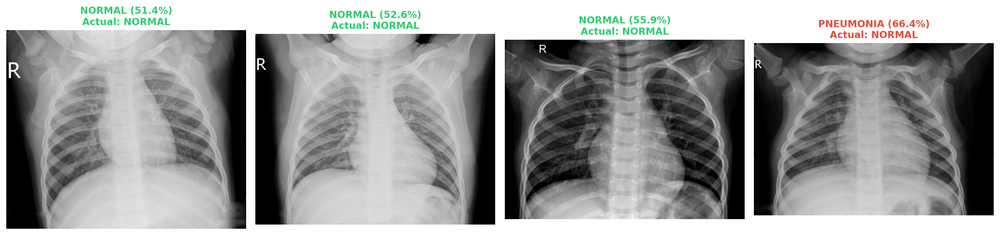
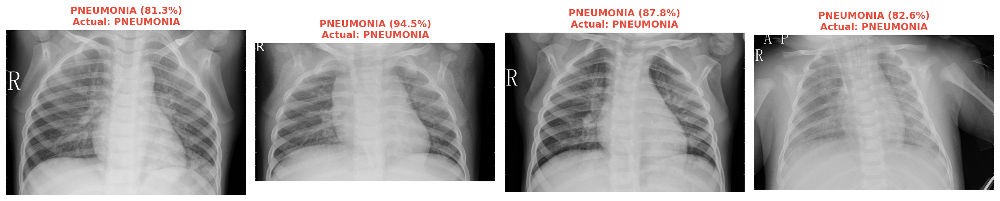
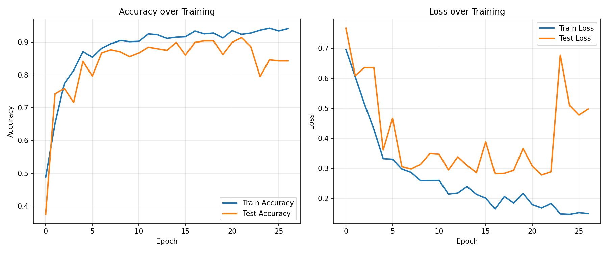

# Pneumonia Classifier

A deep learning project that classifies chest X-ray images as **Normal** or **Pneumonia** using a Convolutional Neural Network (CNN). The goal of this project is to demonstrate the application of deep learning in medical image classification and provide an end-to-end workflow from data preprocessing to model evaluation.

---

## 📌 Overview

Pneumonia is a lung infection that can be detected through chest X-ray images. In this project, a CNN model is trained to distinguish between healthy lungs and lungs affected by pneumonia.

The project includes image preprocessing, model training, performance evaluation, and prediction on unseen chest X-ray images using TensorFlow and Keras.

---

## ✨ Features

- Chest X-ray image classification
- Image preprocessing and normalization
- CNN model training
- Model evaluation
- Prediction on new images
- Training accuracy and loss visualization

---

## 🛠️ Technologies Used

- Python
- TensorFlow
- Keras
- OpenCV
- NumPy
- Matplotlib

---

## 📂 Project Structure

```
pneumonia-classifier/
│
├── assets/
│   ├── sample_input.png
│   ├── prediction.png
│   ├── accuracy.png
│   └── loss.png
│
├── dataset/
│
├── model/
│
├── notebooks/
│
├── src/
│
├── requirements.txt
│
└── README.md
```

---

## 📸 Results

### Normal Prediction

<p align="center">
    
</p>

---

### Pneumonia Prediction

<p align="center">
    
</p>

---

### Training Curve

<p align="center">
    
</p>

---

## 🧠 Model Pipeline

```
Chest X-ray Images
        │
        ▼
Image Preprocessing
        │
        ▼
Data Augmentation
        │
        ▼
CNN Model
        │
        ▼
Training
        │
        ▼
Evaluation
        │
        ▼
Prediction
```

---

## ⚙️ Installation

Clone the repository.

```bash
git clone https://github.com/Sagamyn/pneumonia-classifier.git
```

Move into the project directory.

```bash
cd pneumonia-classifier
```

Install the required dependencies.

```bash
pip install tensorflow keras opencv-python numpy matplotlib scikit-learn pillow
```

---

## 🚀 Usage

Run the training script.

```bash
python pneumonia_classifier.py
```

> Replace the filenames if your project uses different script names.

---

## 📚 What I Learned

This project helped me gain practical experience in:

- Convolutional Neural Networks (CNN)
- Medical image classification
- Image preprocessing and augmentation
- TensorFlow and Keras workflows
- Model training and evaluation
- Deep learning pipeline development

---

## 🤝 Contributing

Contributions, suggestions, and improvements are welcome.

Feel free to fork the repository and submit a pull request.

---
